## Базова функціональність системи
Проєкт складається з трьох модулів: `messages-service`, `logging-service` та `facade-service`. Використовується сервер для асинхронної обробки даних Netty (замість звичайного Tomcat Embedded) + Spring WebFlux.

### Архітектура facade-service (http://localhost:8085)
Мається два ендпоїнти - `POST /facade/write-log` та `GET /facade/logs-messages`

#### POST /facade/write-log
Створює JSON об'єкт, та надсилає його до `POST logging-service/logging`, із наявним механізмом retry (5 спроб через кожні 2 секунди).

#### GET /facade/logs-messages
Повертає агрегований JSON об'єкт, в якому міститься респонс із `GET logging-service/logging` та `GET messaging-service/messaging`.
`logging-service` повертає масив, тому конкатенація відбувається на рівні фасаду.

### Архітектура logging-service (http://localhost:8087)
Мається два ендпоїнти - `POST /logging` та `GET /logging`

#### POST /logging
Додається новий запис до `ConcurrentHashMap` за ключом UUID.
Для дедуплікації запитів (у разі якщо таке стається) використовується UUID із запиту, який служить в якості "Idempotency Key".

#### GET /logging
Повертається об'єкт із усіма повідомленнями як JSON array.

### Архітектура messaging-service (http://localhost:8089)
Мається ендпоїнт-заглушка `GET /messaging`, який повертає `{ "msg": "not implemented yet" }

## Приклад використання
Використовується HTTP client, вбудований в IntelliJ IDEA Ultimate (замість Postman, Bruno та аналогів).
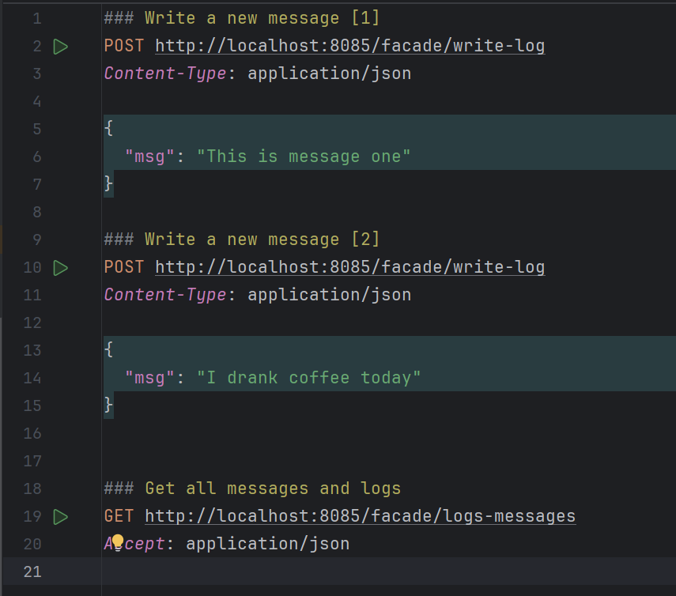
Запустимо `facade-service` та надішлемо запит `POST facade-service/facade/write-log`, коли `logging-service` ще не запущено.
Побачимо такі логи...
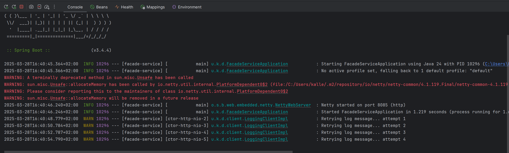
Запускаємо `logging-service`
Останній лог було написано о 16:40:54. Сервіс запустився о 16:40:55, і о 16:40:56 було успішно збережено повідомлення.
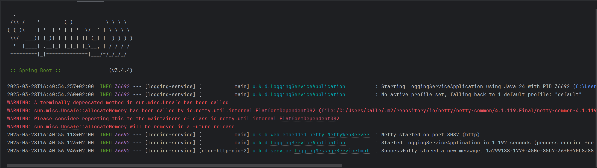
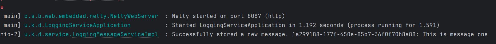
Візьмемо UUID (1a299188-177f-450e-85b7-36f0f70b8a88) та зробимо запит до `logging-service` самостійно, використовуючи той самий айді.
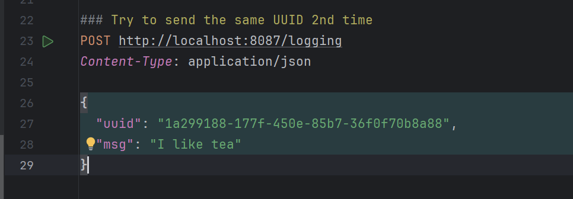
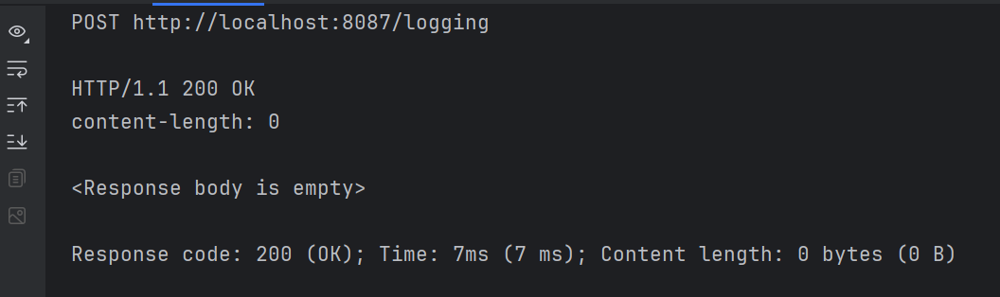
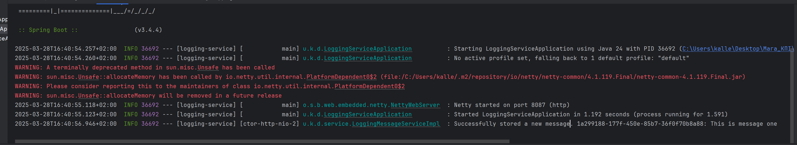
Нового значення не з'явилось, логу у мікросервісі немає.
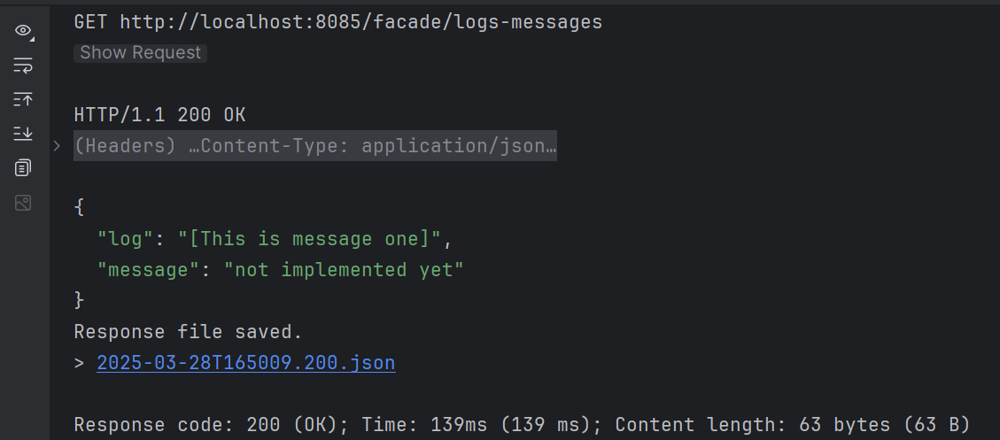
Додаємо ще один лог, через `facade-service`
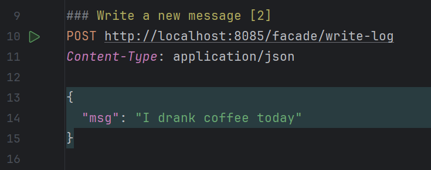
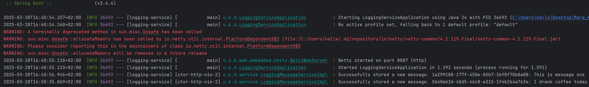
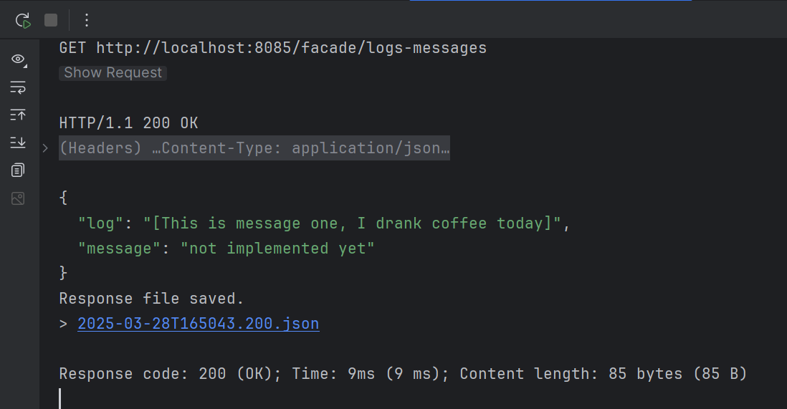