### Налаштування кластера Kafka
#### Створимо тестовий топік на машині №2

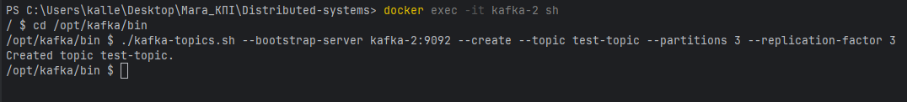

#### Перевіримо що топік був створений на машині №1

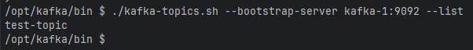

#### Подивимось на топік з машини №3

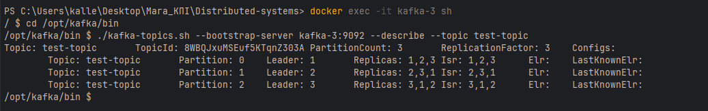

#### На машинах №1 та №2 запустимо `consumer` та `producer`

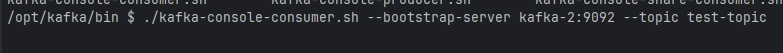
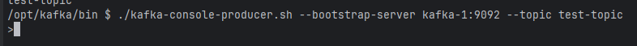
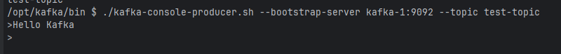
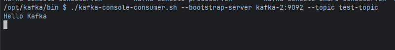

#### Реплікація даних працює

## Базова функціональність системи
Проєкт складається з трьох модулів: `messages-service`, `logging-service` та `facade-service`. Використовується сервер для асинхронної обробки даних Netty (замість звичайного Tomcat Embedded) + Spring WebFlux.
Додатково було додано щось на кшталт конфіг сервера: `config-server`
Загальна структура сервісів виглядає наступним чином:

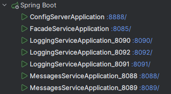

### Архітектура facade-service (http://localhost:8085)
Мається два ендпоїнти - `POST /facade/write-log` та `GET /facade/logs-messages`

#### POST /facade/write-log
Створює JSON об'єкт, та надсилає його до `POST logging-service/logging`, із наявним механізмом retry (5 спроб через кожні 2 секунди).

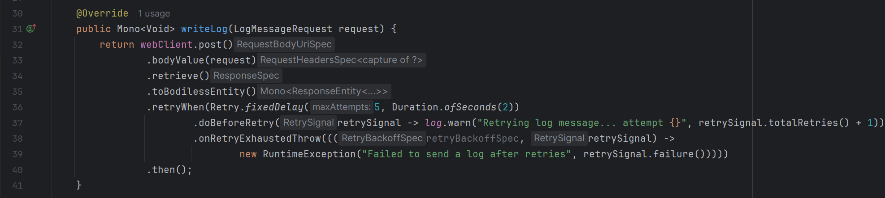

#### GET /facade/logs-messages
Повертає агрегований JSON об'єкт, в якому міститься респонс із `GET logging-service/logging` та `GET messaging-service/messaging`.
`logging-service` повертає масив, тому конкатенація відбувається на рівні фасаду.

### Архітектура logging-service (http://localhost:8090, http://localhost:8091, http://localhost:8092)
Сервіси було зконфігуровано у Hazelcast кластер:

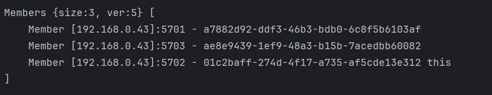

Мається два ендпоїнти - `POST /logging` та `GET /logging`

#### POST /logging
Додається новий запис до `IMap` за ключом UUID.
Для дедуплікації запитів (у разі якщо таке стається) використовується UUID із запиту, який служить в якості "Idempotency Key".

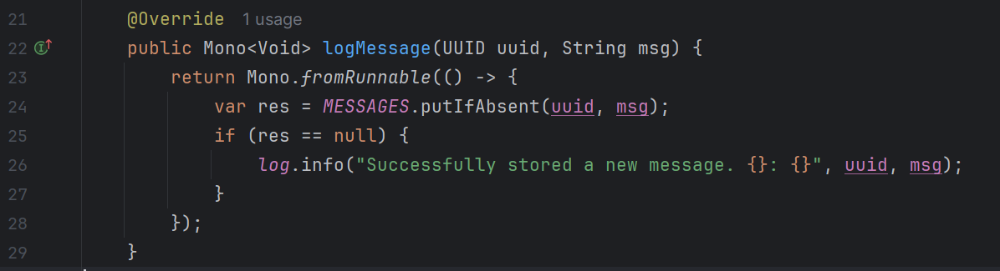

#### GET /logging
Повертається об'єкт із усіма повідомленнями як JSON array.

### Архітектура messaging-service (http://localhost:8088, http://localhost:8089)
Мається ендпоїнт `GET /messaging`, який повертає всі повідомлення, що були завантажені в мапу в пам'яті.

Консьюмери розподілились таким чином.

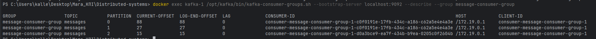

#### Завдання

### Записати 10 повідомлень через `facade-service`

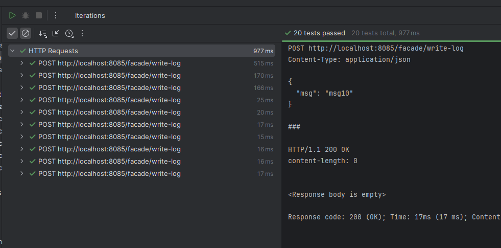
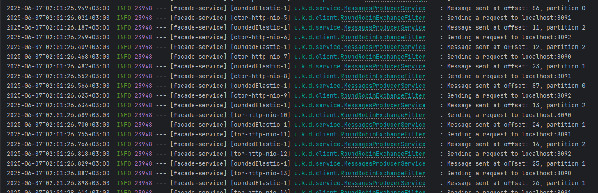

### Показати які повідомлення отримав кожен з екземплярів `logging-service` та `facade-service`

#### Розподілення логів

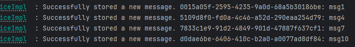
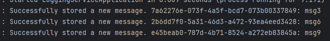
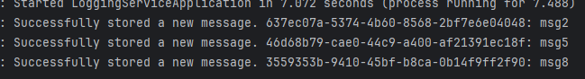

#### Розподілення повідомлень

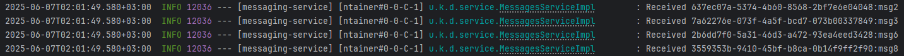
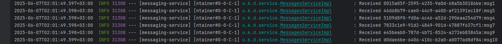

### Декілька разів викликати HTTP GET на `facade-service` та отримати об'єднані дві множини повідомлень

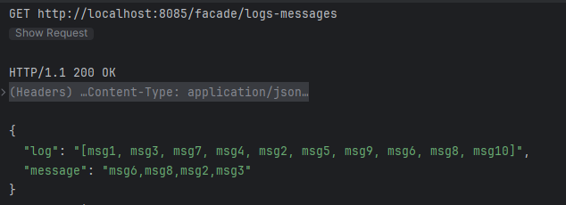
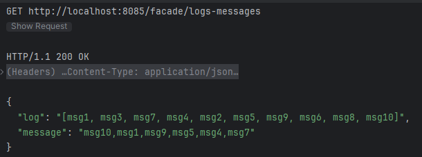

### Перевірка відмовостійкості черги повідомлень

#### Вимкніть обидва екземпляри `messaging-service`

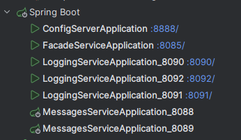

#### Відправте 10 (буде 12) повідомлень через `facade-service`

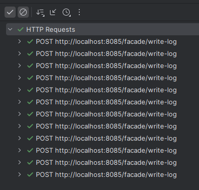
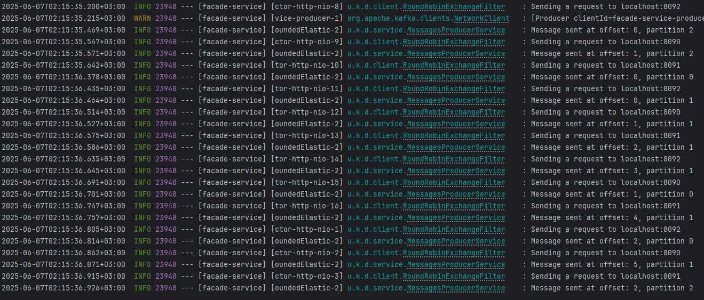

#### Вимкніть один із серверів MQ

Спочатку було встановлено 3 партішени, тобто на кожен з них кластер визначає свого лідера. Напевне, для виконання задачі треба було зробити 1 партішен, тому перестворимо топік з цією конфігурацією.

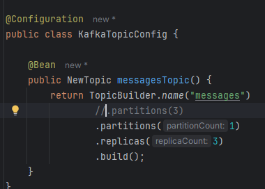

Перезапустимо всю систему та побачимо оновлений кластер. Лідер - `kafka-2`

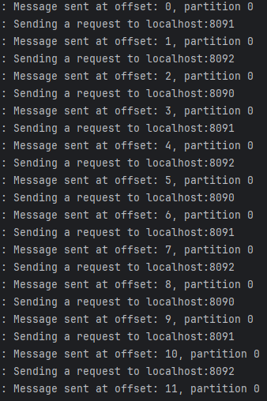
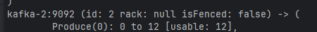

Вимикаємо `kafka-2`

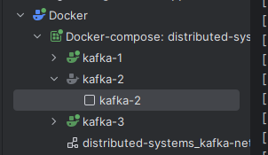

Запускаємо `messaging-service` та бачимо, що до партішену під'єднався тільки один інстанс, та вичитав всю чергу

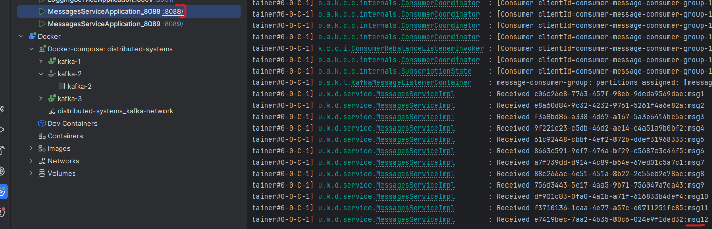

Фундаментальне правило Kafka - один `listener` на один партішен на одну консьюмер-групу.
Якщо задати іншому інстансу `messaging-service` іншу групу, то повідомлення будуть прочитані на обох інстансах.

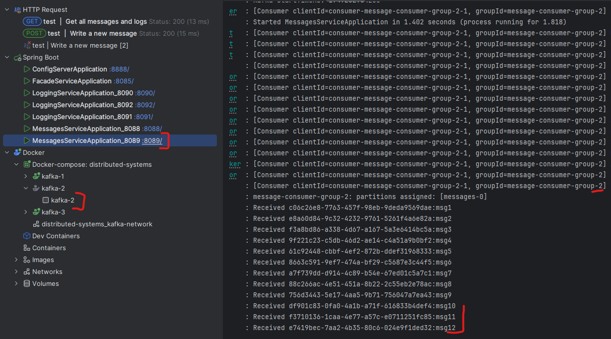