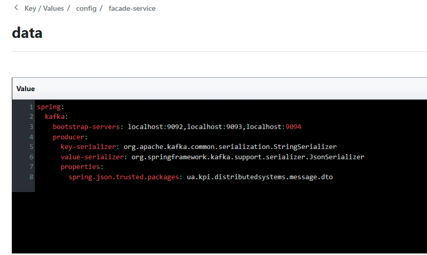

### Всі мікросервіси мають самостійно динамічно реєструватись при старті у Consul, кожного з сервісів може бути запущено кілька екземплярів (це буде відображатись як кількість instances на UI)

### При звертанні facade-service до logging-service та messages-service, IP-адреси (і порти) мають зчитуватись facade-service з Consul. Немає бути задано в коді чи конфігураціях статичних значень адрес.

### Налаштування для клієнтів Hazelcast мають зберігатись як key/value у Consul і зчитуватись logging-service

### Налаштування для Message Queue (адреса, назва черги, …) мають зберігатись як key/value у Consul і зчитуватись facade-service та messages-service

### Продемонструвати, що у випадку відключення екземпляру певного мікросервісу, це буде відображатись у Consul (відключений екземпляр сервісу змінить статус) , а виклики будуть перенаправлятись до інших працюючих екземплярів.

#### Spring Boot запускає процес дереєстрації при спробі кільнути процес, тому довелося його стопати через дебагер

#### Клієнт самостійно дізнається про здорові сервіси, і робить запити виключно на них