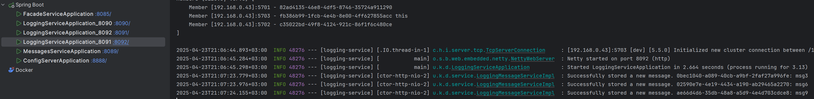

## Базова функціональність системи
Проєкт складається з трьох модулів: `messages-service`, `logging-service` та `facade-service`. Використовується сервер для асинхронної обробки даних Netty (замість звичайного Tomcat Embedded) + Spring WebFlux.
Додатково було додано щось на кшталт конфіг сервера: `config-server`
Загальна структура сервісів виглядає наступним чином:

### Архітектура facade-service (http://localhost:8085)
Мається два ендпоїнти - `POST /facade/write-log` та `GET /facade/logs-messages`

#### POST /facade/write-log
Створює JSON об'єкт, та надсилає його до `POST logging-service/logging`, із наявним механізмом retry (5 спроб через кожні 2 секунди).

#### GET /facade/logs-messages
Повертає агрегований JSON об'єкт, в якому міститься респонс із `GET logging-service/logging` та `GET messaging-service/messaging`.
`logging-service` повертає масив, тому конкатенація відбувається на рівні фасаду.

### Архітектура logging-service (http://localhost:8090, http://localhost:8091, http://localhost:8092)
Сервіси було зконфігуровано у Hazelcast кластер:

Мається два ендпоїнти - `POST /logging` та `GET /logging`

#### POST /logging
Додається новий запис до `IMap` за ключом UUID.
Для дедуплікації запитів (у разі якщо таке стається) використовується UUID із запиту, який служить в якості "Idempotency Key".

#### GET /logging
Повертається об'єкт із усіма повідомленнями як JSON array.

### Архітектура messaging-service (http://localhost:8089)
Мається ендпоїнт-заглушка `GET /messaging`, який повертає `{ "msg": "not implemented yet" }

## Приклад використання (лаба 3)
Приклад відповіді для конфіг-сервера

Запити до фасаду:

Перевірка:

Вимикаємо дві ноди `logging-service`:

Робимо запит до працездатної ноди. Повідомлення збереглись. На виконання запиту пішло суттєво більше часу (5 секунд).

Це відбувається через те, що мапа зконфігурована на створення двох бекапів у кластері:

### Відомі недоліки:
1. Немає наявності ретраїв на запити `GET /logging`
2. RoundRobinExchangeFilter не вміє дивитись "чи жива наступна нода за списком"