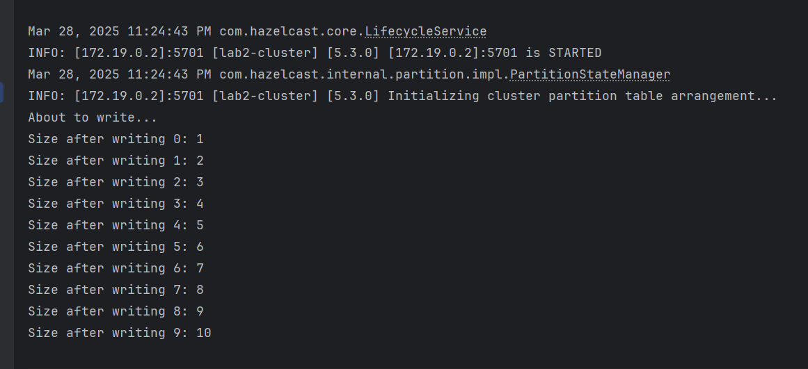

### Попередні дані
Для запуску Management Center:
```shell
docker run --rm -p 8080:8080 --network bridge hazelcast/management-center:5.3.4
```
Для запуску програми з декількох Hazelcast нод:
```shell
# from ./hazelcast folder
docker build -t kpi-hazelcast:latest
docker run --rm -p 1998:1998 -p 1999:1999 -p 2000:2000 --network bridge kpi-hazelcast:latest
```
### Звіт
Логи інстансу


#### Використовуючи API, створіть Distributed Map, та запишіть в неї 1000 значень з ключами від [0,1000)


Код програми використовував тільки одну ноду Hazelcast, на порті 2000.
#### За допомогою Management Center подивіться на розподіл ключів по нодах

Налаштування кластеру.


Приблизно рівномірний розподіл значень, хоч і використовувалась тільки одна нода для додавання нових ключів.
#### Подивіться, як зміниться розподіл даних по нодах, якщо відключити одну ноду

Для шатдауну ноди можна використати той самий Management Center. Далі наведений приклад з уже вимкненою нодою.


Володіння ключами перейшло на інші ноди

#### Послідовне вимкнення двох нод

Вимкнемо 2000 порт...


Все збережено.

#### Паралельне вимкнення двох нод

Для цього треба перезапустити інстанси в docker-compose.

Додавання інстансів із compose.


Призупинимо два інстанси Hazelcast.
```shell
docker ps
```

```shell
docker kill -s KILL hz-1 hz-2
```


Відбулася втрата даних. Для попередження цієї ситуації треба підняти кількість бекапів у конфігурації мапи.


Хоч менеджер і показує "Entries" з розподілом, але дані все одно зберігаються при паралельному вимкненні нод.


### Distributed Map
#### Без блокування


#### Песимістичне блокування


#### Оптимістичне блокування


Песимістичне блокування помітно повільніше, аніж оптимістичне.

### Bounded Queue

#### Приклад "нормальної роботи". Вичитування проходить рівномірно.


#### Приклад роботи інстанса, що наповнює чергу, але немає читання.



І зависло. Програма нескінченно чекає на момент, коли черга звільниться.
